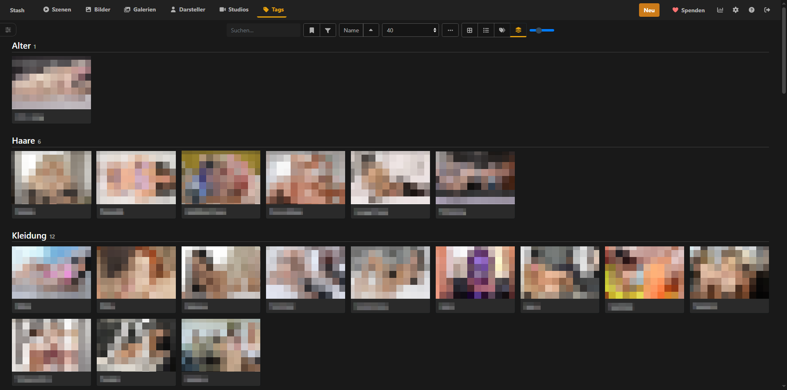
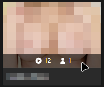
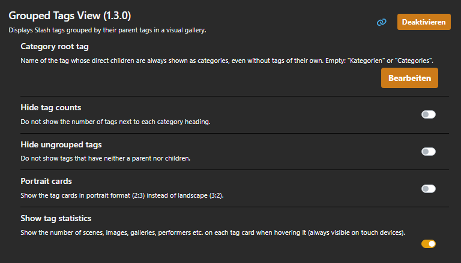

<div align="center">

# Grouped Tags View

### A categorised tag gallery for Stash

Turns the flat tags page of [Stash](https://github.com/stashapp/stash) into a gallery
grouped by category: parent tags become headings, their child tags image cards.

<p>
  
  
  
  
</p>

**[Overview](#-overview)** ·
**[Features](#-features)** ·
**[Screenshots](#-screenshots)** ·
**[How Categories Work](#-how-categories-work)** ·
**[Installation](#-installation)** ·
**[Setting Up Categories](#-setting-up-categories)** ·
**[Configuration](#-configuration)**

</div>

<br/><br/>

##  Overview

**Grouped Tags View** is a UI plugin that adds a grouped view to the tags page of Stash.

Stash already supports parent and child tags, but the tags page lists every tag on its
own. This plugin uses those existing relationships to show the tags as a list of
categories instead – for example *Location* with *Beach*, *Hotel* and *Pool* below it.

The plugin is a different way of looking at your tags. It uses nothing but the tags,
images and parent/child relationships you maintain in Stash, has no database of its own
and does not change your data (with one optional exception, see
[How Categories Work](#-how-categories-work)).

<br/><br/>

##  Features

- **Categorised gallery** — Every category is a heading with its child tags below as image cards. A click on a card opens the normal tag page.

- **Seamless toggle** — A new *Grouped* button sits next to Stash's *Grid*, *List* and *Tagger* buttons. *Grid* still shows the original gallery, and your choice is remembered.

- **Search and filters** — The search field and the sidebar filters of the tags page also apply to the grouped view. Stash itself evaluates them, so the results match the original list.

- **Collapsible categories** — Click a category heading to collapse or expand it. The state is remembered in the browser; while searching, all categories are open.

- **Empty categories** — An optional category root tag lets new categories appear before they have any tags.

- **Zoom slider** — Stash's zoom slider controls the card size.

- **Tag statistics** — Optionally shows the number of scenes, images, galleries, performers etc. when hovering a card, linked to the filtered lists like in Stash.

- **Fits in** — Uses Stash's theme classes, works with dark themes, adapts to phones and tablets and follows the Stash language (English and German).

<br/><br/>

##  Screenshots

<div align="center">



<sub>The grouped view with the new <b>Grouped</b> button next to Grid, List and Tagger.</sub>

<br/><br/>



<sub>Optional tag statistics when hovering a card.</sub>

<br/><br/>



<sub>The plugin settings.</sub>

</div>

<br/><br/>

##  The Problem

### Flat tag lists

Stash shows all tags on one page, sorted by name and split into pages of 40. With
a growing number of tags it becomes hard to see which tags belong together.

### Hierarchy without a view

Stash can already arrange tags in parents and children, but the tags page does not
use this structure.

### No concept of categories

Stash does not distinguish between a category and a normal tag. A new, still empty
category tag looks exactly like any other tag without a parent.

<br/><br/>

##  The Solution

### Categories from your existing tags

Grouped Tags View reads all tags with their parents in a single request and builds
the categories from them. Parent tags become headings, their direct children become
cards. Tags that belong to no category are collected at the bottom.

### Part of the tags page

The grouped view replaces only the result area of the tags page. Stash's toolbar,
search, sidebar filters and zoom slider stay where they are and also work in the
grouped view.

### An explicit marker for empty categories

An optional root tag (*Categories* by default) marks empty categories. Every direct
child of this tag is shown as a category, even before it has tags of its own.

<br/><br/>

##  How Categories Work

| **Tag in Stash** | **Shown as** |
| :--- | :--- |
| Has child tags | Category heading |
| Direct child of the category root tag | Category heading, also when empty (`0`) |
| Child of a category | Card in that category |
| Neither a parent nor child tags | Card under **Ungrouped** (always at the bottom) |
| The category root tag itself | Not shown |

A tag with several parents appears in each of their categories.
Categories and cards are sorted alphabetically, using the tag's *sort name* if set.

**Example:**

```text
In Stash                             Grouped Tags View
────────────────────────────────     ─────────────────────────────
Categories          (root tag)       Clothing      0
├── Clothing        (no tags yet)    Location      3   [Beach] [Hotel] [Pool]
└── People                           People        2   [Couple] [Solo]
    ├── Solo                         Ungrouped     1   [Favourites]
    └── Couple
Location
├── Beach
├── Hotel
└── Pool
Favourites
```

You do not need the root tag if all your categories already have child tags.
If you want to create it, the grouped view shows a button for it while the tag does
not exist. This is the only change the plugin ever makes to your data. It happens
only when you click the button, and the tag is created with *Ignore auto tag* enabled.

<br/><br/>

##  Tech Stack

| **Area** | **Technology** | **Purpose** |
| :--- | :--- | :--- |
| **Plugin Code** |  | Plain JavaScript, no build step. |
| **UI Integration** |  | React components and patches through Stash's `PluginApi`. |
| **Data** |  | Tags, matches and statistics through Stash's GraphQL API. |
| **Styling** |  | CSS Grid layout on top of Stash's Bootstrap theme classes. |

<br/><br/>

##  Installation

### Prerequisites

- Stash **v0.31.1** or newer (older versions may work but are untested)

### Install from the plugin source

1. In Stash, open **Settings → Plugins → Available Plugins** and click **Add Source**.
2. Enter the name `JimnyCricket` and the source URL
   `https://xxjimnycricketxx.github.io/stash-plugins/index.yml`.
3. Install **Grouped Tags View** and reload the page.

### Usage

Open **Tags** and click the new **Grouped** button (layers icon) next to the
*Grid*, *List* and *Tagger* buttons.

<br/><br/>

##  Setting Up Categories

Categories are built from the parent/child relationships of your tags, which you
set in Stash itself.

### Create a category with tags

1. Create a tag for the category, e.g. *Location*.
2. Open a tag that belongs to it, e.g. *Beach*, click **Edit** and add *Location* under
   **Parent Tags**. Save.
3. *Location* now appears as a category with *Beach* as a card.

Alternatively, open the category tag and add its tags under **Sub-Tags**.

### Assign many tags at once

1. On the tags page, switch to **Grid** or **List** view (the grouped view has no selection).
2. Select the tags with their checkboxes.
3. Click **Edit** in the toolbar and add the category under **Parent Tags**.

### Create an empty category

1. Create the category root tag once – either with the button shown in the grouped view
   or manually as a tag named *Categories*.
2. Create the new category, e.g. *Clothing*, and add *Categories* under **Parent Tags**.
3. *Clothing* appears as a category with `0` tags until you add some.

### Change the order

Categories and cards are sorted alphabetically by name. To change the position of a tag
without renaming it, set a **Sort Name** in the tag's edit form, e.g. `01` for *Location*.
The sort name is only used for sorting – the tag is still displayed as *Location*.

<br/><br/>

##  Configuration

All settings are found under **Settings → Plugins → Grouped Tags View**.

| **Setting** | **Type** | **Default** | **Description** |
| :--- | :---: | :---: | :--- |
| Category root tag | Text | *empty* | Name of the root tag whose direct children are always shown as categories. Empty uses `Categories` or `Kategorien`. |
| Hide ungrouped tags | Yes/No | No | Hides the *Ungrouped* section. |
| Hide tag counts | Yes/No | No | Hides the number of tags next to each category heading. |
| Show tag statistics | Yes/No | No | Shows scene, image, gallery, performer etc. counts when hovering a card (always visible on touch devices). |

Card size is controlled with Stash's own zoom slider in the toolbar.

> [!WARNING]
> Settings are loaded when the tags page is opened. After changing them,
> leave the tags page and open it again.

<br/><br/>

##  Roadmap

- [x] Grouped gallery with category headings and image cards
- [x] Toggle next to Stash's display mode buttons
- [x] Search and sidebar filters
- [x] Settings, category root tag, English and German texts
- [x] Optional tag statistics
- [x] Collapsible categories
- [ ] Change the category order directly in the view (today: via *Sort Name*)
- [ ] Card format: landscape or portrait

<br/><br/>

##  License

This plugin is licensed under the **MIT License**.

See [`LICENSE`](../../LICENSE) for details.

<br/><br/>

---

<br>

<div align="center">

<a href="../../README.md">
  
</a>
<a href="https://github.com/xXJimnyCricketXx">
  
</a>
<a href="https://cricketcode.de">
  
</a>

</div>
